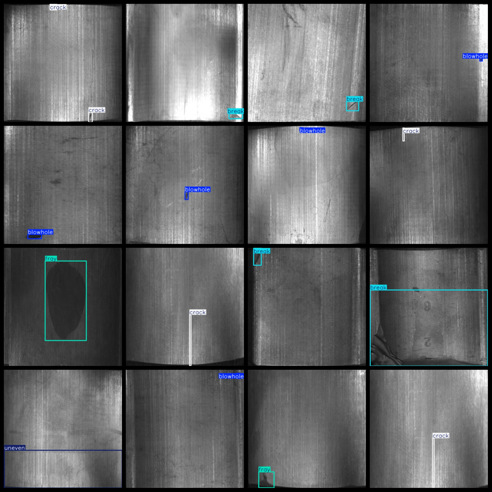

# Magnetic Tile Surface Defect Dataset
368 images, 5-class defect VOC+YOLO format

The dataset format includes both VOC and YOLO formats.

The zipped package contains three folders: JPEGImages, Annotations, and labels.

In the JPEGImages folder, there are a total of 368 JPEG images.

In the Annotations folder, there are a total of 368 XML files.

In the labels folder, there are a total of 368 txt files.

There are a total of 5 types of labels: ["blowhole", "break", "crack", "fray", "uneven"].

These labels are: [“Aperture”，“Break”，“Crack”，“Abrasion”，“Uneven”].

Each label has a corresponding number of boxes (note that the order in the YOLO format may differ from this, but it aligns with the classes.txt file in the labels folder).

- "blowhole" has 124 boxes.
- "break" has 119 boxes.
- "crack" has 69 boxes.
- "fray" has 41 boxes.
- "uneven" has 106 boxes.
- The total number of boxes is 459.

The image resolution is clear.

The images have not been enhanced.

The shape of the labels is rectangular boxes, used for object detection recognition.

Important note: No guarantee is made regarding the accuracy or weights of the trained models. The dataset provides accurate and reasonable annotations only.

Annotation and image details are as follows:
## Images

---

Here is a pay link on Stripe (https://buy.stripe.com/3cs8yP7sY87d0vu9AB). Please contact me lonlonago@foxmail.com after funding $89, and I will send you a complete data files, thank you!

